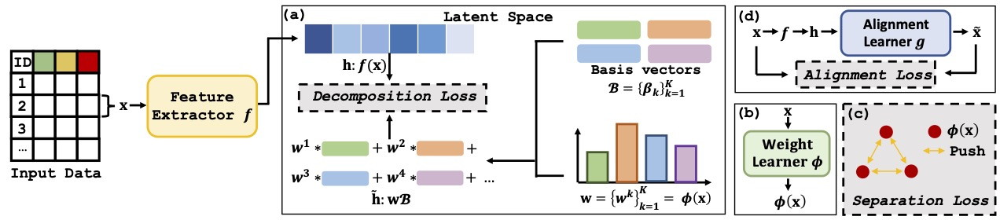

<h1 align="center">
[ICLR 2025]DRL: Decomposed Representation Learning for Tabular Anomaly Detection<br>
Links: [<a href="https://openreview.net/forum?id=CJnceDksRd">OpenReview</a>]
</h1>

**📥 Contact Email Update:** Please use **yeht22@mails.jlu.edu.cn** for all future communications. The previous email (yeht2118@mails.jlu.edu.cn) is no longer active.

## 📖 Overview

To address the data entanglement issue in tabular anomaly detection, in this paper, we propose a novel approach Decomposed Representation Learning (DRL), to re-map data into a tailor-designed constrained space, in order to capture the underlying shared patterns of normal samples and differ anomalous patterns for TAD. Specifically, we enforce the representation of each normal sample in the latent space to be decomposed into a weighted linear combination of randomly generated orthogonal basis vectors, where these basis vectors are both data-free and training-free. Furthermore, we enhance the discriminative capability between normal and anomalous patterns in the latent space by introducing a novel constraint that amplifies the discrepancy between these two categories, supported by theoretical analysis. 



## ⚙️ Environment Setup

Recommended for readers: create the environment directly from
`environment.yml`.

```bash
cd DRL

conda env remove -n drl -y 2>/dev/null || true
conda env create -f environment.yml
conda activate drl

# Environment check
python check_env.py
```

Expected from `python check_env.py`:

- `torch`, `numpy`, `scipy`, `sklearn`, `pandas`, and `ipdb` should all import successfully.
- If you want GPU acceleration, `torch.cuda.is_available()` should be `True`.
- On Apple Silicon, `torch.backends.mps.is_available()` can be used to verify MPS.

If you see `No matching distribution found` during installation:

- This is usually caused by package index or network configuration.
- Check the current pip configuration with `python -m pip config list`.
- Retry with `-i https://pypi.org/simple` or your preferred mirror.
- If you need a CUDA-specific PyTorch build on Linux, replace the `torch` wheel after environment creation using the command generated by the official PyTorch selector.

Recommended reproducibility settings before running experiments:

```bash
export PYTHONHASHSEED=0
export OMP_NUM_THREADS=1
export MKL_NUM_THREADS=1
export OPENBLAS_NUM_THREADS=1
export VECLIB_MAXIMUM_THREADS=1
export NUMEXPR_NUM_THREADS=1
```

Notes:

- The repository reads datasets from `./Data`.
- Supported dataset files are `.npz`, `.mat`, and `.csv`.
- `main.py` automatically chooses `mps`, `cuda`, or `cpu` when `--device auto` is used.

## 🛫 Quick Start

Create `models/`, and `results/` first:

```bash
mkdir -p models results
```

#### Option A: Run the total experiments across all datasets:

```bash
python run_job.py
```

#### Option B: Run a single dataset (for example, `arrhythmia`):

The dataset-specific `epoch`, `preprocess`, `input_info_ratio`, and `cl_ratio` values are taken from `predefines.py`.

```bash
python main.py \
  --dataname arrhythmia \
  --model_type PN \
  --preprocess none \
  --diversity True \
  --plearn False \
  --input_info True \
  --input_info_ratio 0.1 \
  --cl True \
  --cl_ratio 0.06 \
  --prototype_num 5 \
  --seed 42 \
  --epoch 80 \
  --device auto
```

Output locations:

- Trained checkpoints are saved to `./models/`.
- Metrics are saved to `./results/`.
- Training logs are also written under `./models/` as `.log` files.


## 🤗 Citing the paper
If our work is useful for your own, you can cite us with the following BibTex entry:

    @inproceedings{
    ye2025drl,
    title={{DRL}: Decomposed Representation Learning for Tabular Anomaly Detection},
    author={Hangting Ye and He Zhao and Wei Fan and Mingyuan Zhou and Dan dan Guo and Yi Chang},
    booktitle={The Thirteenth International Conference on Learning Representations},
    year={2025},
    url={https://openreview.net/forum?id=CJnceDksRd}
    }
